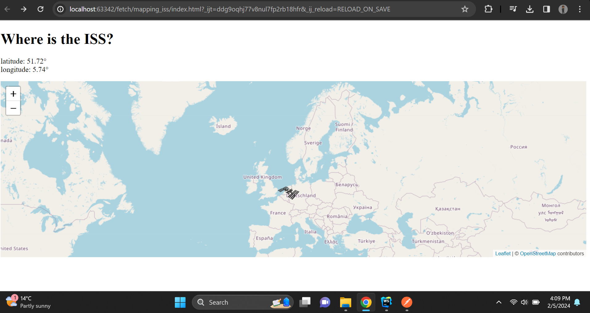

```
# International Space Station (ISS) Tracker

This project fetches real-time data about the International Space Station (ISS) from the Where the ISS at? API and displays its current location on an interactive map using Leaflet.js.

## Features

- Displays the latitude and longitude of the ISS.
- Updates the ISS marker on the map in real-time.
- Automatically adjusts the map view to center around the ISS location.
- Uses custom icons for the ISS marker.

## Technologies Used

- HTML
- CSS
- JavaScript
- Leaflet.js
- Where the ISS at? API

```
```
## How it Works

- The HTML file sets up the structure of the webpage.
- Leaflet.js is used to create an interactive map and display the ISS marker.
- JavaScript is used to fetch data from the Where the ISS at? API, update the ISS marker's position, and adjust the map view.
- The CSS file contains styles for the map container.

## Credits

- Leaflet.js: [Leaflet](https://leafletjs.com/)
- Where the ISS at? API: [Where the ISS at?](https://wheretheiss.at/)
- OpenStreetMap: [OpenStreetMap](https://www.openstreetmap.org/)

## Screenshots

```
